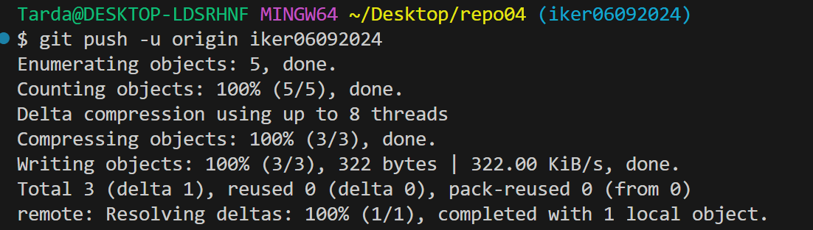
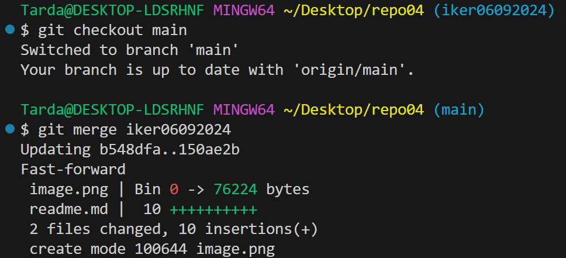
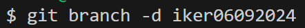
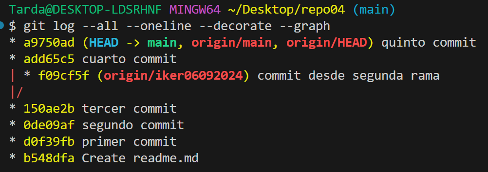
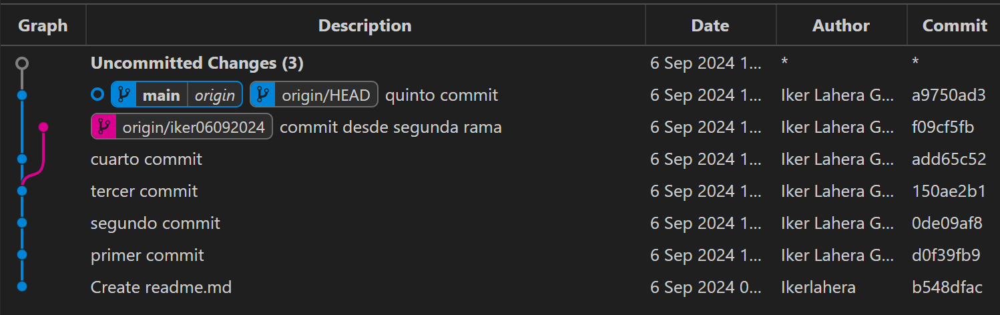

# Repositorio 04

Mi primer ejercicio con ramas 

1. crear rama y cambiarte a esa rama

2. subo la rama al remoto

3. primer commit y segundo commit

4. Cambio a rama main y merge

5. Borro la rama en local

6. Resultado